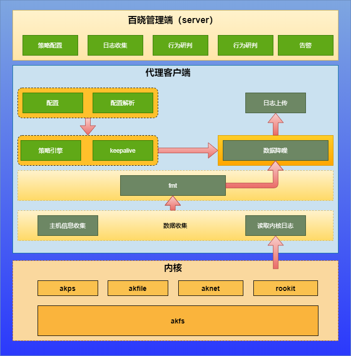

###  百晓HIDS👋

<h3 align ="center"><a href="#about"> about </a>|<a href="#code">  code  </a>|<a href="#interface"> interface </a>|<a href="#install"> install </a>|<a href="#poc"> 案例 </a></h3>

---
<h3 id="about"> about </h3>

​	**godSkills**是一款由 百晓团队开发维护的主机行为监测系统。基于内核hook行为采集主机侧进程行为、文件变动以及网络事件行为。
​	

  

---
<h3 id="code"> code </h3>

| 仓库 | 说明 |
| ------------------------------------------------------------ | -------------- |
| ✨ [akserver](https://github.com/bx-sec/akserver)    | 百晓服务端 |
| ✨ [akagent](https://github.com/bx-sec/akagent)    | 百晓客户端代理程序源码 |
| ✨ [akfs](https://github.com/bx-sec/akfs)    | 内核模块,百晓基础架构层,提供文件操作接口、hook接口以及获取基本信息的接口 |
| ✨ [akfile](https://github.com/bx-sec/akfile)    | 内核模块,抓取进程生命周期内对文件的操作行为数据 |
| ✨ [akps](https://github.com/bx-sec/akps)    | 内核模块,抓取进程创建、exec和进程退出的数据 |
| ✨ [aknet](https://github.com/bx-sec/aknet)    | 内核模块,抓取进程操作进程生命周期内对网络资源的操作行为数据 |

---
<h3 id="interface"> interface </h3>
| 接口以及捕获信息说明 |
| ------------------------------------------------------------ |
|[进程监控](https://www.yuque.com/zvqzmr/ntx0hm/zvz9s5)|
|[文件监控](https://www.yuque.com/zvqzmr/ntx0hm/gxlb5n)|
|[网络监控](https://www.yuque.com/zvqzmr/ntx0hm/ebxe9x)|

---
<h3 id="install"> install </h3>
- [安装文档](https://www.yuque.com/zvqzmr/ntx0hm/tu5p9r)

---
<h3 id="poc"> poc </h3>
- [案例](https://www.yuque.com/zvqzmr/wwfguk)

